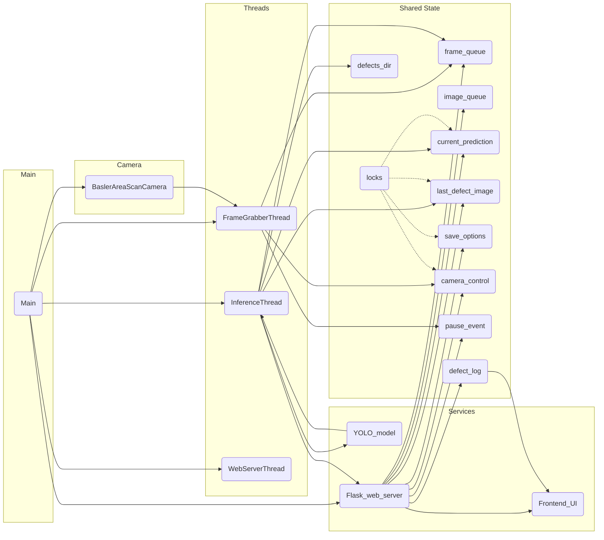

# Basler AOI — 使用者導向說明 📘

> 簡短說明：這個子專案實作了基於 Basler 相機與 YOLO 推論的 AOI 缺陷檢測流程，並提供一個 Web UI（Flask）用於即時監控、缺陷回放與管理。

---

## 快速參考（Quick Reference）🧾

- 一行啟動（預設使用模擬相機）:

```bash
cd aoi/basler_aoi
python main.py
```

- 若要使用 CPU 推論，請在 `aoi/basler_aoi/threads/inference.py` 的 `self.model.predict(..., device=0, ...)` 改為 `device='cpu'`。
- 常用 REST API:
  - `GET /api/prediction` — 目前分類與信心度
  - `GET /api/last-image` — 最新缺陷影像(Base64)
  - `POST /api/save-defect` — 切換是否保存缺陷影像（body: {"enable": true|false}）
  - `POST /api/pause` `/api/resume` — 暫停 / 恢復系統
  - `GET /api/defect-stream` — SSE 缺陷事件流
  - `GET /api/defect-logs` — 取得缺陷日誌（metadata）

---

## 快速啟動範例（步驟） 🚀

1. 安裝依賴（建議使用虛擬環境）:
```bash
pip install -r requirements.txt
pip install -r requirements-gpu.txt  # 若要 GPU 支援（選用）
```
2. 若未連接實體相機：程式已在 `main.py` 設定 `os.environ['PYLON_CAMEMU']='2'` 啟用相機模擬器，可直接執行。
3. 指定模型或修改參數（如必要）：編輯 `main.py` 中 `InferenceThread(..., "model/best_ccdft_260107_1.pt", ...)` 為你的模型路徑。
4. 執行服務：
```bash
python main.py
```
5. 開啟瀏覽器：前往 `http://127.0.0.2:8000`（可修改 `web_server.run_server()` 的 host / port）

---

## 主要功能概覽 ✅

- 讀取 Basler 工業相機（支援 LineScan 與 AreaScan）或使用相機模擬器（`PYLON_CAMEMU=2`）。
- 將影像透過「Grabber」執行緒送入處理隊列。
- 使用 Ultralytics YOLO 模型執行即時推論（InferenceThread）。
- 檢測到缺陷時可：
  - 以標記影像（含框與標籤）更新「最後缺陷影像」以供 Web 顯示
  - 選擇性地保存到 `defects/` 目錄
  - 記錄於伺服器端日誌，並以 SSE (Server-Sent Events) 推送給前端（即時通知）
- 提供一個前端頁面（`templates/index.html`）來：顯示即時分類、信心度、隊列狀態、最新缺陷影像、缺陷日誌與非阻塞檢視器。

---

## 架構與流程說明 🔧

### Architecture Diagram (Mermaid)



### 1) 相機層（`camera/line_camera.py`）
- BaslerLineScanCamera：線掃相機介面，回傳單列像素（line）。通常與 `stitcher` 配合。
- BaslerAreaScanCamera：面掃相機（影像輸出），支援設置曝光、FPS、模擬影像模式（可指定資料夾作為影像來源）。

### 2) 取得影像的執行緒（`threads/garbber.py`）
- `LineGrabberThread`：讀取每一條 line 並放入 `line_queue`。
- `StitchThread`（`threads/stitcher.py`）：將多條 line 堆成一張影像，放到 `image_queue`（用於線掃系統）。
- `FrameGrabberThread`：對面掃相機，持續抓取 `frame` 並放入 `frame_queue`。會觀察 `camera_control`（開/關）與 `pause_event`（暫停/恢復）。

### 3) 推論並處理結果（`threads/inference.py`）
- `InferenceThread` 載入指定的 YOLO 模型（預設在 `main.py` 中有一個示例路徑），對影像進行推論。
- 若偵測到缺陷：
  - 使用 `draw_boxes()` 在影像上標記
  - 更新 `last_defect_image`（Base64）供前端快速獲取
  - 視情況將影像保存到 `defects/`（若 `save_defect` 為 True）
  - 呼叫 `web_server.record_defect()` 在伺服器端記錄並通知 SSE clients

### 4) Web 服務 (Flask)（`web_server.py` + `templates/index.html`）
- 初始化：`init_app(...)` 由 `main.py` 傳入共享物件（像是預測 result、locks、queues、pause/camera control、defect condition 等）。
- 重要 Endpoint：
  - `GET /api/prediction`：回傳當前分類 & 信心度
  - `GET /api/last-image`：回傳最後一張缺陷影像（Base64）
  - `POST /api/save-defect`：開/關是否保存缺陷影像
  - `POST /api/pause` & `/api/resume`：暫停 / 恢復系統
  - `GET /api/defect-stream`：SSE 推送缺陷事件（前端用於即時播放）
  - `GET /api/defect-logs` 與 `GET /api/defect-b64/<id>`：取得日誌與單筆圖片 Base64
  - `GET /api/defect-image/<filename>`：直接存取 `defects/` 目錄中的已存檔案
- Web UI 支援自動播放缺陷、手動檢視已存影像、顯示隊列/相機/存檔/暫停狀態等：訪問 http://127.0.0.2:8000（如 main.py 啟動設定）

---

## 快速上手（使用者步驟） 🚀

1. 先安裝相依套件（repo 根目錄有 requirements）：
   - 主要需要：`pypylon` (Basler SDK), `ultralytics` (YOLO), `opencv-python`, `flask`, `flask-cors`, `numpy` 等。
2. 若沒有實體相機：在 `main.py` 已預設設定 `os.environ['PYLON_CAMEMU']='2'` 開啟相機模擬器。若要使用實體相機，移除或改變此設定。
3. （可選）在 `line_camera` 或 `BaslerAreaScanCamera.ImageFilename` 設定一個可讀取的資料夾作為影像來源（模擬模式）。
4. 修改模型路徑（如需要）：`main.py` 裡 `InferenceThread(..., "model/best_ccdft_260107_1.pt", ...)` 可以替換為你訓練或下載的模型檔案路徑。
5. 執行：
   ```bash
   cd aoi/basler_aoi
   python main.py
   ```
6. 開啟瀏覽器：前往 http://127.0.0.2:8000 查看即時 UI。

---

## 常見操作說明（UI）🕹️

- 存檔 ON/OFF：按「存檔」按鈕會呼叫 `/api/save-defect` 切換。若開啟，檢測到的缺陷將被保存於 `defects/`。
- Camera ON/OFF：呼叫 `/api/camera` 控制相機啟動或關閉（由 `FrameGrabberThread` 管理）。
- 暫停 / 恢復：可暫停推論與儲存行為（`/api/pause`、`/api/resume`）。
- 缺陷日誌 & 檢視：前端會透過 SSE 即時接收缺陷事件，並可在列表中用「檢視」打開已存影像。

---

## 設定建議與除錯小貼士 ⚠️

- Host/Port：伺服器目前綁定 `127.0.0.2:8000`（在 `web_server.run_server()`）；若需要改成 `0.0.0.0` 或不同 port，可於此處修改。
- 模組與硬體：若遇到 `pypylon` 無法連線，請先確認 Basler 驅動與 SDK 是否已安裝；若使用模擬模式，確認 `ImageFilename` 指向一個有效的圖片資料夾。
- GPU/Device：Inference 使用 `device=0`（GPU），若要使用 CPU，請在 `threads/inference.py` 中的 `self.model.predict(..., device=0, ...)` 改為 `device='cpu'`。
- 權限問題：寫入 `defects/` 及讀取資料集路徑時，確保執行使用者有讀寫權限。
- 日誌：Flask 的 werkzeug 日誌被關閉以降低噪音，若要開啟請調整 `web_server.log.setLevel(...)`。

---

## 檔案清單（快速參考）📁

- `main.py` — 系統啟動腳本，建立相機、隊列、執行緒與 Web 伺服器。
- `web_server.py` — Flask 伺服器與 API / SSE。
- `camera/line_camera.py` — Basler 相機的 wrapper（Line/Area 模式）。
- `threads/garbber.py` — Grabber & FrameGrabber 執行緒。
- `threads/stitcher.py` — 將線掃條組成影像。
- `threads/inference.py` — 載入 YOLO 模型進行推論、處理與保存缺陷。
- `templates/index.html` — 前端 UI；使用 SSE 與 REST API 與後端互動。

---

## 常見問題（FAQ）❓

- **Q:** 執行時出現 `No Basler camera found` 或 `pypylon` 相關錯誤，該怎麼辦？
  - **A:** 如果沒有實體相機，請確認 `PYLON_CAMEMU=2` 是否被設定（`main.py` 已預設）。若要使用實體相機，請確認 Basler SDK 與驅動已安裝並且相機連接正常。

- **Q:** 無法載入模型或出現 `ultralytics` 錯誤？
  - **A:** 確認 `model/` (或 `main.py` 中指定的路徑) 有正確的 `.pt` 模型檔案，並檢查 `ultralytics` 與相依套件已安裝。若使用 GPU，確認 CUDA 與相容版本的驅動已安裝。

- **Q:** 想要在 CPU 上跑推論怎麼做？
  - **A:** 在 `aoi/basler_aoi/threads/inference.py` 中，將 `device=0` 改成 `device='cpu'`，或修改為你欲使用的 device string。

- **Q:** 為什麼沒有看到 SSE 事件或前端不更新？
  - **A:** 檢查瀏覽器是否能連到 `http://127.0.0.2:8000`（host/port 相符）、以及是否有 CORS/網路阻斷（例如不同 host 或防火牆）。Server 必須能正常執行並且 `record_defect()` 被呼叫。

- **Q:** 無法寫入 `defects/` 檔案？
  - **A:** 檢查執行者的檔案系統權限，或手動建立空目錄 `defects/` 並賦予寫入權限。

---

## 一頁快速參考卡（Quick Reference）🗂️

- 啟動：`python main.py`（預設模擬相機）
- 停止：Ctrl+C
- 開關存檔：按前端的 `存檔` 按鈕或呼叫 `POST /api/save-defect` (JSON: {"enable": true/false})
- 暫停 / 恢復系統：`POST /api/pause` / `POST /api/resume`
- 重要檔案位置：`defects/`（已存檔影像）、`model/`（模型）

---

## 我可以幫你做的下一步 💡

- 若你想，我可以再把 README 補上實際的**啟動腳本範例**、**操作截圖**（我可以幫你建立 images/placeholder 與說明如何新增截圖），或把快速參考卡剪成一個 README 頁首的簡短 Summary。請告訴我你想要加入的截圖或要突顯的指令，我會幫你更新檔案。

---

需要我把 README 的變更推上 Git（commit）嗎？ 或是要我把 README 轉成繁簡雙語版本？